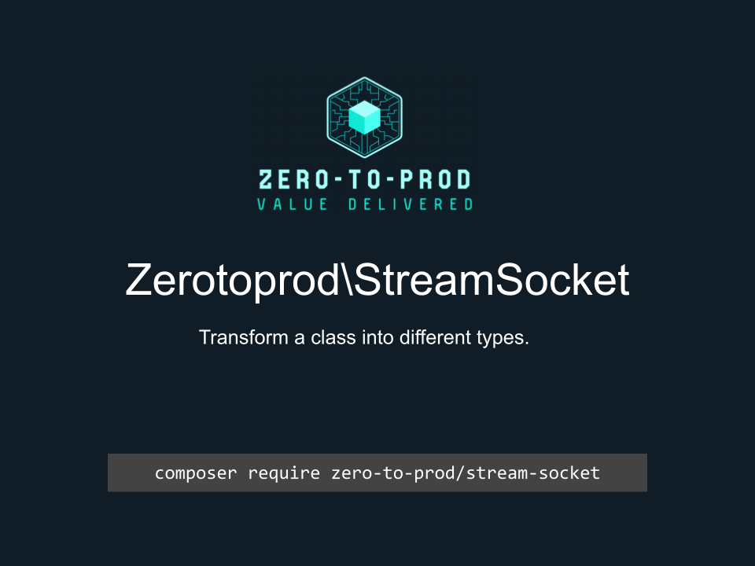

# Zerotoprod\StreamSocket



[](https://github.com/zero-to-prod/stream-socket)
[](https://github.com/zero-to-prod/stream-socket/actions)
[](https://github.com/zero-to-prod/stream-socket/actions)
[](https://packagist.org/packages/zero-to-prod/stream-socket/stats)
[](https://packagist.org/packages/zero-to-prod/stream-socket)
[](https://github.com/zero-to-prod/stream-socket)
[](https://github.com/zero-to-prod/stream-socket/blob/main/LICENSE.md)
[](https://hitsofcode.com/github/zero-to-prod/stream-socket/view?branch=main)

## Contents

- [Introduction](#introduction)
- [Requirements](#requirements)
- [Installation](#installation)
- [Usage](#usage)
- [Documentation Publishing](#documentation-publishing)
  - [Automatic Documentation Publishing](#automatic-documentation-publishing)
- [Local Development](./LOCAL_DEVELOPMENT.md)
- [Contributing](#contributing)

## Introduction

A wrapper for the [`stream_socket_client()`](https://www.php.net/manual/en/function.stream-stream-socket.php) method.

It provides classes that define all the options for this method.

## Requirements

- PHP 7.1 or higher.

## Installation

Install `Zerotoprod\StreamSocket` via [Composer](https://getcomposer.org/):

```shell
composer require zero-to-prod/stream-socket
```

This will add the package to your project’s dependencies and create an autoloader entry for it.

## Usage

```php
use Zerotoprod\StreamSocket\StreamSocket;

StreamSocket::client(
    'ssl://'.$url.':'. 443,
    30
    STREAM_CLIENT_CONNECT,
    stream_context_create()
);

echo $SocketClient->remoteSocketName(); // 34.223.124.45:443

$SocketClient->close();
```

## Documentation Publishing

You can publish this README to your local documentation directory.

This can be useful for providing documentation for AI agents.

This can be done using the included script:

```bash
# Publish to default location (./docs/zero-to-prod/stream-socket)
vendor/bin/zero-to-prod-stream-socket

# Publish to custom directory
vendor/bin/zero-to-prod-stream-socket /path/to/your/docs
```

### Automatic Documentation Publishing

You can automatically publish documentation by adding the following to your `composer.json`:

```json
{
  "scripts": {
    "post-install-cmd": [
      "zero-to-prod-stream-socket"
    ],
    "post-update-cmd": [
      "zero-to-prod-stream-socket"
    ]
  }
}
```

## Contributing

Contributions, issues, and feature requests are welcome!
Feel free to check the [issues](https://github.com/zero-to-prod/stream-socket/issues) page if you want to contribute.

1. Fork the repository.
2. Create a new branch (`git checkout -b feature-branch`).
3. Commit changes (`git commit -m 'Add some feature'`).
4. Push to the branch (`git push origin feature-branch`).
5. Create a new Pull Request.
